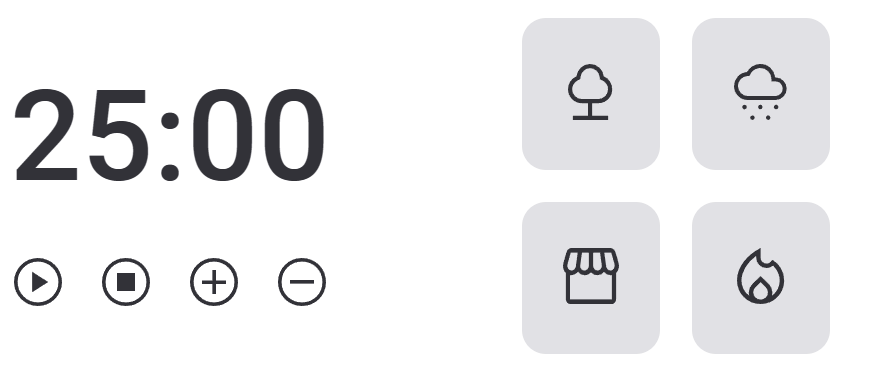

<h1 align="center">FOCUS TIMER   </h1>

 
 

  

 
    <a href="https://fernandoaugustodev.github.io/Treine.me/" target="_blank" ><button style = "font-size:20px; border-radius:6px; padding: 10px; background: #02799D; color: #fff" >VEJA O PROJETO</button></a>

## 💻 Sobre o Projeto
 

  O Projeto é de um cronômetro com funcionalidades avançadas. Ele permite iniciar, pausar, parar e aumentar ou diminuir o tempo em cinco minutos. Além disso, ele conta com recursos de som para ajudar o usuário a manter o foco nas suas atividades. Quando o tempo estabelecido é alcançado, o cronômetro tocará um alarme para avisar o usuário de que o tempo acabou.

 

## 🛠 Techs

Tecnologias usadas neste projeto

✅ HTML  
✅ CSS  
✅ JAVASCRIPT
   - IMPORTAÇAO E EXPORTAÇAO DE ARQUIVOS JS
   - FACTORY 
   - INJEÇÃO DE DEPENDÊNCIA
   - CLEAN CODE
   - EVENTOS DE CLICK
---

## 👨🏼‍💻 Autor

Fernando Augusto 

 
  
 
© 2022 GitHub, Inc.
Terms Privacy Security Status Docs
